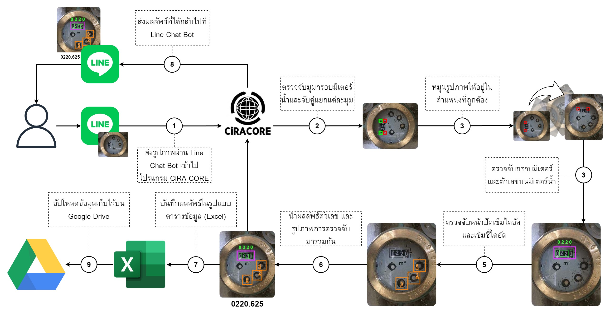
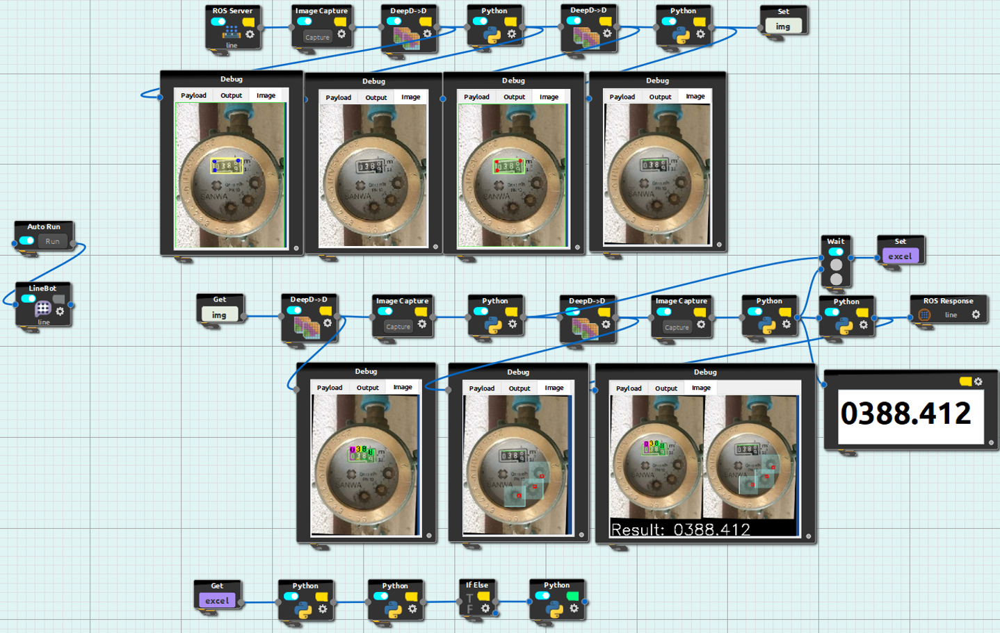

# The Application of Deep Learning Technology for Reading Water Meter using CiRA CORE
The architecture of the developed model is based on YOLOv4-tiny and developed in CiRA CORE. We implemented five models: 
  1. Water meter frame detection model.
  2. Number detection model.
  3. Dial detection model.
  4. Dial pointer detection model.
  5. Water meter frame corner model.

The purpose of this project is to learning how to use CiRA CORE, design and develop water meter reading and detection, design and develop system flow, determine performance of each model and create experience in developing deep learning model.

Installation guide (Thai): [คู่มือ.pdf](https://github.com/redsoul2032/detect_meterwater_cira/files/12737923/default.pdf)

Overview Concept
-------------------------------

The process start from (1) Input SANWA water meter image to line chat bot >> (2) Detect meter frame corner >> (3) Rotate image to correct position >> (4) Detect meter and number >> 
(5) Detect dial and pointer >> (6) Combine result >> (7) Save result into datasheet >> (8) Return result to line chat bot >> (9) Upload datasheet and result to google drive.

Overview System
-------------------------------

To use this project you can download zip file and open project in software call CiRA CORE, to make it work you need to setup DeepD->D modules by add .weight file in lib folder to the modules, and apply [these code](https://github.com/redsoul2032/project-ciracore-detect-watermeter) to python module.
